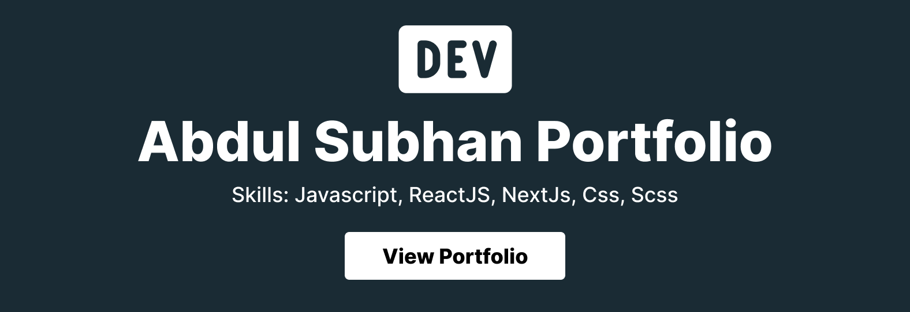

<p align="center"> 
    </img>
</p>

<h1 align="center"> Software Engineer Abdul Subhan Portfolio 🔥 </h1> 
<h3 align="center"> A clean, beautiful, responsive, and 100% customizable portfolio <br /> template for Software Developers! </h3>

<p align="center">
  <a href="https://nodejs.org/en/blog/release/v20.11.1"></a>
  <a href="https://www.npmjs.com/package/npm/v/10.2.4"></a>
  <a href="https://reactjs.org/"></a>
  <a href="https://join.slack.com/t/masterportfolio/shared_invite/zt-g772n1fo-Ns4usanURF8jVb8wk2lRAA"></a>
  <a href="https://github.com/prettier/prettier"></a>
  <br/>
  <a href="http://badges.mit-license.org/"></a>
  <a href="https://github.com/subhan8799/masterPortfolio/commits/master"></a>
  <a href="http://badges.mit-license.org/"></a>
  <a href="https://abdulsubhan.com/"></a>
</p>

:star: Star us on GitHub — it helps!

# Sections 📚

✔️ Summary and About me\
✔️ Skills \
✔️ Experience\
✔️ Education\
✔️ Contact me

To view a live example, **[click here](https://main--abdul-subhan-portfolio.netlify.app/)**

# Clone and Use 📋

- The website is completely built on `react-js` library of `javascript` and that's why we need `nodejs` and `npm` installed
- While installing `nodejs` and `npm`, try to install versions which are equal or greater than the versions mentioned in badges above
- In case you want to help developing it or simply saving it, you can fork the repository just by clicking the button on the top-right corner of this page
- After the successful installation of `nodejs` and `npm`, clone the repository into your local system using below command:
  ```bash
   git clone https://github.com/subhan8799/abdul-subhan-portfolio.git
  ```
  This will clone the whole repository in your system.
- To download required dependencies to your system, navigate to the directory where the cloned repository resides and execute following command:
  ```node
  npm install
  ```
- Now the project is ready to use
- You can check it using `npm start`, it will open the website locally on your browser.


### Personal Information

You will find `src/portfolio.js` file which contains the complete information about the user. The file looks something like below:

```javascript
// Home Page
const greeting = {
    ...
}

// Social Media
const socialMediaLinks = {
    ...
}

...
```

You can change the personal information, experience, education, social media, blog information, contact information etc. in `src/portfolio.js` to directly reflect them in portfolio website.

### How to change the icons on homepage under what i do section?

1. This section pulls data from `skills` in portfolio.js file.
2. Visit this website: https://icon-sets.iconify.design/
3. Search for the skill you are looking to add.
4. Select the icon of your choice.
5. Copy the text beside **Selected Icon** and replace it with `fontAwesomeClassName` of that particular softwareSkill.

#### How to use custom images instead of Iconify Icons?

1. Add a valid image file into the `public/skills` folder
2. Insert the image name into the `imageSrc` attribute of the particular softwareSkill
3. Remove the `fontAwesomeClassName` property or leave it empty because it takes precedence over `imageSrc`
4. Add custom styling to the `img` using the `style` Property

## Other

- You need to change the website title and other descriptions in `public/index.html`
- You can define your own favicon in `public/icons` directory. If you don't have a favicon, you can generate favicons from [Favicon Generator](https://www.favicon-generator.org/) and [Favicon IO](https://favicon.io/)
- You can also edit your website preview (known as description image). Run your site locally, take a screenshot and replace with `public/icons/desc.png`. Note that your screenshot should be 1280x640 for better preview.

# Choose Theme 🌈

- You can take a look at `src/theme.js` file where all available themes are mentioned with their respective color codes
- At the bottom of this file you will see the below code:
  - `export const chosenTheme = blueTheme;`
  - You need to change the name from `blueTheme` to whatever theme you want to set your website to
  - You can define new theme similarly as other themes and you can assign name of that new defined theme to `chosenTheme`
- That's it. You just need to change the theme name and the code will take care of everything else
- Run `npm start` to check if everything is ok.

# Deployment 📦

- Once you are done with your setup and have successfully completed all steps above, you need to put your website online!
- I highly recommend using [Github Pages](https://create-react-app.dev/docs/deployment/#github-pages) to achieve this the EASIEST WAY.
- To deploy your website, you have two options. First you need to create a github repository with the name `<your-github-username>.github.io`. Please don't give it any other name.
- Now, you need to generate a production build and deploy the website.

**Option 1:**

- Run `npm run build` to generate the production build folder.
- Enter the build folder, `git init` and push the generated code to the `master` branch of your new repository on github. That's it. It's Done.
- You may need to `git init` and force push at every new build.

**Option 2 (will not work with [user pages](https://docs.github.com/en/github/working-with-github-pages/about-github-pages)):**

- Run `npm run deploy` to build and create a branch called `gh-pages`. It will push the `build` files to that branch.
- The last step in deploying is to enable `Github Pages` in settings of the repository and select `gh-pages` branch.

Now, your website is successfully deployed and you can visit it at `<your-github-username>.github.io`.  
If you are stuck somewhere and want to observe the deployment process in depth, then please watch below video.

# Technologies used 🛠️

- [React](https://reactjs.org/)
- [Node-Js](https://nodejs.org/en)
- [React-Icon](https://react-icons.github.io/react-icons/)
- [styled-components](https://styled-components.com/)

